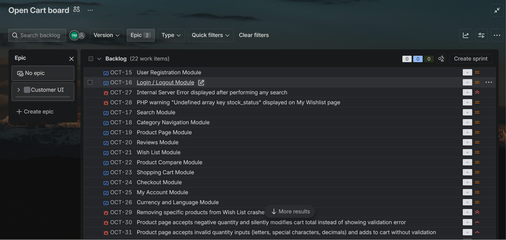
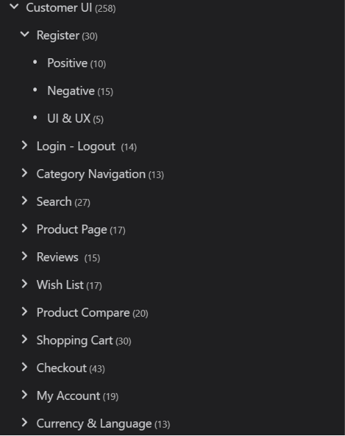
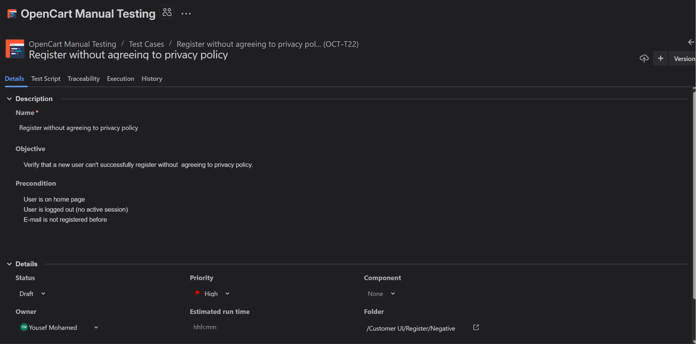
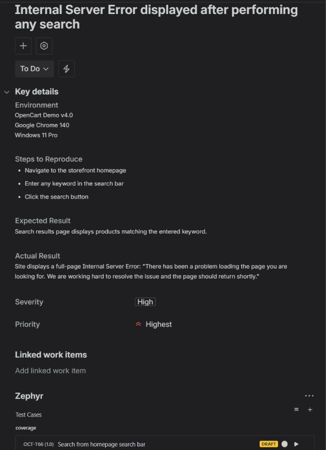
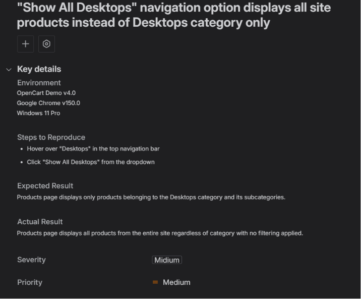

# OpenCart Manual Testing Portfolio

A comprehensive manual testing project on the [OpenCart](https://demo.webocreation.com/) e-commerce demo platform, built as a portfolio piece to demonstrate real-world QA engineering skills — from test planning and design through to defect reporting, traceability, and shift-left testing practice.

---

## Project Overview

| | |
|---|---|
| **Application Under Test** | OpenCart Demo v4.0 |
| **Project Type** | Manual Testing (Phase 1) |
| **Test Management** | JIRA + Zephyr Scale |
| **Project Key** | OCT |
| **Total Test Cases** | 258 |
| **Total Bugs Reported** | 8 |
| **Improvement Tickets** | 2 |
| **Testing Duration** | 14 days |
| **Tester** | Yousef Mohamed |

---

## Tools & Technologies

| Tool | Purpose |
|---|---|
| JIRA (Company-Managed) | Bug reporting, project tracking, Epic/Story structure |
| Zephyr Scale | Test case design, folder organization, labels, traceability |
| OpenCart Demo v4.0 | Application under test |
| Google Chrome | Test execution browser |
| Claude (Anthropic) | AI assistant used to accelerate test case documentation |
| GitHub | Portfolio documentation and version control |

---

## Testing Scope

All testing was performed on the **Customer-facing storefront** of the OpenCart demo application.

### Modules Tested

| Module | Test Cases | Type |
|---|---|---|
| User Registration | 30 | Functional + UI/UX |
| Login / Logout | 14 | Functional + UI/UX |
| Category Navigation | 13 | Functional + UI/UX |
| Search | 27 | Functional + UI/UX |
| Product Page | 17 | Functional + UI/UX |
| Reviews | 15 | Functional + UI/UX |
| Wish List | 17 | Functional + UI/UX |
| Product Compare | 20 | Functional + UI/UX |
| Shopping Cart | 30 | Functional + UI/UX |
| Checkout | 43 | Shift-Left (Specification-Based) |
| My Account | 19 | Functional + UI/UX |
| Currency & Language | 13 | Functional + UI/UX |
| **Total** | **258** | |

---

## Test Design Approach

Each module is organized into three test categories:

- **Positive** — valid inputs and expected happy-path flows
- **Negative** — invalid inputs, boundary violations, and edge cases
- **UI & UX** — interface rendering, default states, visual consistency, and error message presentation

### Techniques Applied

- **Equivalence Partitioning (EP)** — grouping inputs into valid and invalid classes to avoid redundant test cases
- **Boundary Value Analysis (BVA)** — testing at and around field length limits (e.g. password min 4 / max 20 characters, name field boundaries)
- **Shift-Left Testing** — Checkout module test cases were designed from specification before execution, simulating how QA engineers work in Agile environments when features are not yet fully accessible
- **Exploratory Testing** — used alongside scripted test cases to discover unexpected defects such as the cart quantity manipulation bug and Wish List crash

---

## Project Structure in JIRA & Zephyr Scale

### JIRA Structure
- **Epic:** Customer UI
- **Stories:** One per module (OCT-15 through OCT-26), linked to their Epic
- **Bugs:** Logged with severity, priority, environment, steps to reproduce, expected vs actual results
- **Traceability:** Every bug is linked to the specific failing test case in Zephyr Scale

### Zephyr Scale Folder Structure

Every module contains three subfolders — Positive, Negative, and UI & UX — applied consistently across all 12 modules.

```
Customer UI (258)
├── Register (30)
│   ├── Positive
│   ├── Negative
│   └── UI & UX
├── Login - Logout (14)
│   ├── Positive
│   ├── Negative
│   └── UI & UX
├── Category Navigation (13)
│   ├── Positive
│   ├── Negative
│   └── UI & UX
├── Search (27)
│   ├── Positive
│   ├── Negative
│   └── UI & UX
├── Product Page (17)
│   ├── Positive
│   ├── Negative
│   └── UI & UX
├── Reviews (15)
│   ├── Positive
│   ├── Negative
│   └── UI & UX
├── Wish List (17)
│   ├── Positive
│   ├── Negative
│   └── UI & UX
├── Product Compare (20)
│   ├── Positive
│   ├── Negative
│   └── UI & UX
├── Shopping Cart (30)
│   ├── Positive
│   ├── Negative
│   └── UI & UX
├── Checkout (43)
│   ├── Positive
│   ├── Negative
│   └── UI & UX
├── My Account (19)
│   ├── Positive
│   ├── Negative
│   └── UI & UX
└── Currency & Language (13)
    ├── Positive
    ├── Negative
    └── UI & UX
```

### Test Case Labels
Every test case is labeled for easy filtering and traceability:
- **Area label** — `Customer_UI`
- **Module label** — e.g. `Register`, `Search`, `Checkout`
- **Type label** — `Positive`, `Negative`, or `UI_UX`
- **Special label** — `Shift_Left` applied to all Checkout test cases designed from specification

---

## Screenshots

### JIRA Board — Epics & Stories


### Zephyr Scale — Test Case Folder Structure


### Zephyr Scale — Test Case Details (Page 1)


### Zephyr Scale — Test Case Script (Page 2)


### JIRA Bug Report with Zephyr Traceability


### JIRA Bug Report Example


---

## Bug Reports Summary

All bugs were discovered through exploratory and scripted test execution. Each bug is linked to the specific failing test case in Zephyr Scale for full traceability.

| ID | Summary | Severity | Priority |
|---|---|---|---|
| OCT-27 | Internal Server Error displayed after performing any search | High | Highest |
| OCT-28 | PHP warning "Undefined array key stock_status" on Wish List page | High | Medium |
| OCT-29 | Removing specific products from Wish List crashes the site | High | Highest |
| OCT-30 | Product page accepts negative quantity and silently modifies cart | High | High |
| OCT-31 | Product page accepts invalid quantity inputs without validation | High | High |
| OCT-32 | Adding product to Wish List multiple times shows misleading success notification | Medium | Medium |
| OCT-33 | "Show All Desktops" displays all site products instead of Desktops only | Medium | Medium |
| OCT-34 | Back button not visible on Product page when Description tab is active | Low | Low |

---

## Improvement Tickets

| ID | Summary | Priority |
|---|---|---|
| OCT-35 | No persistent navigation link to Product Comparison page | Low |
| OCT-36 | Default items per page (10) causes incomplete last row in product grid — recommend 9 or 12 | Low |

---

## Traceability

Full bidirectional traceability is maintained throughout the project:

- Each **Story** (module) in JIRA is linked to its corresponding **Zephyr Scale test case folder**
- Each **Bug** in JIRA is linked to the specific **failing test case** that revealed it in Zephyr Scale
- Test cases use a consistent **labeling system** (module + type) enabling filtering by area, type, or test approach across all 258 cases

---

## Checkout Module — Shift-Left Testing Note

The OpenCart demo environment does not support a fully functional checkout flow due to all products being marked as out of stock. Rather than skipping this critical module, test cases were designed using a **shift-left testing approach** — writing test cases from specification before execution. This mirrors real Agile QA practice where testers design test cases during the development phase before a feature is fully accessible.

The Checkout module contains 43 test cases covering:
- Guest vs returning customer checkout flows
- Full billing details validation (required fields, BVA on name length)
- Shipping and payment method selection
- Order confirmation and cross-boundary verification (order appearing in admin panel)
- All negative validation scenarios for each checkout step
- UI & UX checks across all 6 checkout steps

All Checkout test cases carry the `Shift_Left` label in Zephyr Scale to clearly distinguish specification-based design from executed test cases.

---

## Phase 2 — Automation (Planned)

This project is structured for Selenium WebDriver automation to be added on top of the existing manual test cases. The planned automation layer will use:

- **Selenium WebDriver** with Java
- Design patterns
- Automation of the regression suite derived from the manual test cases already designed

---

## About This Project

This project was built over 10 days as a portfolio piece to demonstrate practical QA engineering skills. Test case design, scope decisions, module breakdown, bug discovery, and test execution were carried out by me. AI tooling was used to assist with test case documentation and formatting to accelerate the process.

---

## Contact

**Yousef Mohamed**
Junior QA Engineer — Egypt
GitHub: [YousefMo8](https://github.com/YousefMo8)
LinkedIn: [yousefmo8](https://www.linkedin.com/in/yousefmo8/)
Email: yousefjoem@gmail.com
